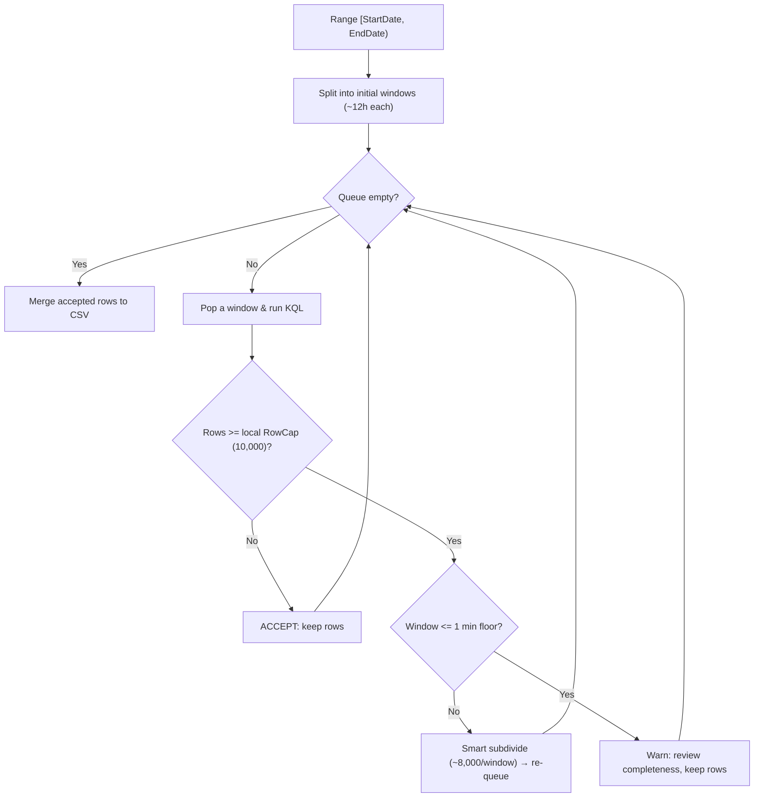

# How it works — adaptive time-slicing

## The service limits and the local safety threshold

Microsoft Defender Advanced Hunting (`security/runHuntingQuery`) enforces
result-count and result-size quotas and does not provide a continuation token.
Current Microsoft documentation lists up to **100,000 rows** and **64 MB** per
result set. Those service limits can change, and the size limit can be reached
before the row limit.

This exporter deliberately uses a lower, configurable **10,000-row local
threshold** by default. Reaching that threshold triggers smaller time windows.
This is conservative partitioning, not a claim that 10,000 is the current service
maximum.

---

## The idea in one sentence

> Keep cutting the time range into smaller pieces until every piece returns under
> the configured local threshold, then combine the pieces.

---

## The algorithm, step by step

1. **Build a queue.** The full range `[StartDate, EndDate)` is chopped into an initial set of windows (default **12 hours** each, capped at `MaxPartitions` windows total).
2. **Query a window.** Pop a window off the queue and run the KQL for just that window.
3. **Decide:**
   - **Under the local threshold** (`< RowCap`, default 10,000)? → **ACCEPT.** Keep the rows.
   - **At or above the local threshold** (`>= RowCap`)? → **SUBDIVIDE.** Use a smaller window as a safety measure.
4. **Subdivide smartly.** Rather than blindly halving, the tool:
   - looks at the timestamps in the (full) batch and measures the **span they actually cover**,
   - estimates **rows per hour** from that span,
   - picks a split factor aimed at **~`TargetRowsPerWindow`** rows (default 8,000) per sub-window - a deliberate buffer under the local threshold.
   - The new sub-windows go **back onto the queue** and get queried in turn.
5. **Respect the floor.** No window is split below **`MinWindowMinutes`** (default 1 minute). If a 1-minute window still reaches `RowCap`, the tool keeps the rows and warns that the output needs completeness review.
6. **Merge.** When the queue is empty, all accepted rows are written to one CSV.

---

## Why no duplicates?

Every window is a **half-open interval** `[start, end)` — the start instant is included, the end instant is not. Because windows are contiguous (`...end` of one equals `...start` of the next) and never overlap, a row that lands exactly on a boundary is counted in **exactly one** window. No row is double-counted, so **no deduplication is required** by default. (An optional `-DedupeKey` exists for edge cases — see [parameters.md](parameters.md).)

---

## A worked example

Suppose you export a **12-hour** window and it comes back with **10,000 rows**,
reaching the conservative local threshold.

1. The tool inspects the returned timestamps and sees that the batch spans **4 hours**. It uses that observed span as a density estimate; it does not assume which part of the 12-hour source window is otherwise complete.
2. Estimated density: `10,000 rows ÷ 4 h ≈ 2,500 rows/hour`.
3. To target ~8,000 rows per window: `8,000 ÷ 2,500 ≈ 3.2 hours` per sub-window.
4. Split factor for a 12-hour window: `ceil(12 ÷ 3.2) = 4`. → four ~3-hour windows are queued.
5. Each ~3-hour window is queried. Most now return well under 10,000 and are **accepted**. Any that still reach the threshold are subdivided again - down toward the 1-minute floor if needed.
6. All accepted rows merge into the final CSV.

The smart step matters: blind halving would have created two 6-hour windows, and the first (holding all the dense data) would saturate *again*, wasting a round trip. Measuring density gets to safe window sizes faster.

---

## Flow diagram

---

## The knobs that shape this

| Parameter | Default | Effect on slicing |
| --- | --- | --- |
| `-RowCap` | 10,000 | Conservative local partition threshold. Lower it to force smaller windows. |
| `-TargetRowsPerWindow` | 8,000 | The target the smart split aims for under the local threshold. |
| `-InitialPartitionHours` | 12 | Size of the first windows before any subdivision. |
| `-MinWindowMinutes` | 1 | The floor — the smallest a window can get. |
| `-MaxPartitions` | 400 | Caps how many *initial* windows are created. |

Full reference: [parameters.md](parameters.md).

## Completeness limitation

Partitioning reduces the chance of reaching the service quotas, but it cannot
prove that every result is complete. A 64-MB response limit can be reached before
`RowCap`, source retention can expire before collection, and the service can
change its limits. Treat threshold warnings as a required review step and compare
output counts with portal/source expectations.
