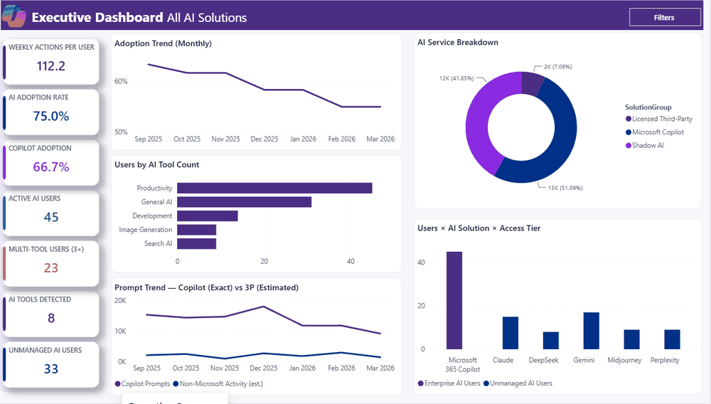

# AI Solutions Intelligence Dashboard

<div align="center">


**A single Power BI report that delivers a complete, defensible view of AI usage across your Microsoft 365 tenant — Copilot adoption, shadow AI, OAuth risk, off-hours/geo anomalies, and (optionally) MDA App Governance & Cloud Discovery — all in one PBIT.**

> **v26.1 — June 23, 2026:** All KQL queries in `kql_queries_v22_E5V3.kql` have been live-tested against a real tenant. Eight bugs fixed across B2, B4, B6, and B8 (UPN resolution, schema portability between Sentinel and native Defender XDR, KQL syntax errors). B3 and B5 validated clean. See the [query pack changelog](kql_queries_v22_E5V3.kql) for details.

### 📥 [Click Here to Download All Files](https://github.com/microsoft/AI-Solutions-Intelligence-Dashboard/archive/refs/heads/main.zip)

**Related Templates & Tools:**

[](DATA_SETUP_START_HERE.md)
[](PAX_Exporter/README.md)
[](AI%20Solutions%20Unified%20May%204th%20v5.pbit)
[](AI_Usage_v26_Blueprint.md)
[](INSTRUCTIONS_v26.md)
[](kql_queries_v22_E5V3.kql)
[](build_v26_sample_data.py)
[](generate_pbit_v26_unified.py)

**Additional Resources:**
[Defender for Endpoint docs](https://learn.microsoft.com/defender-endpoint/) · [Defender for Cloud Apps docs](https://learn.microsoft.com/defender-cloud-apps/) · [Microsoft Purview Audit docs](https://learn.microsoft.com/purview/audit-solutions-overview) · [Microsoft Graph Reports API](https://learn.microsoft.com/graph/api/resources/report)

⭐ **Star this repository** to receive notifications about new template versions
👀 **Watch** for updates and announcements

</div>

---

## ▶️ Report preview

<!-- To enable the animated preview: record the report cycling through its pages, export as images/report-preview.gif, then uncomment the line below. -->
<!-- <div align="center"></div> -->

*An animated tour of all 15 pages is coming soon. Scroll down to the **Report Pages Overview** for a page-by-page description.*

---

## 🧭 Choose how to collect your data

Every tenant loads the **same report** from the **same 12 CSV files** — you just pick how to generate them.

<table>
<tr>
<td width="33%" valign="top">

### 🟢 Under ~10,000 users
**Manual CSV export**

Copy-paste queries into the portal and click Export. Almost no scripting.

➡️ **[Start Here](DATA_SETUP_START_HERE.md)** · [Full manual guide](INSTRUCTIONS_v26.md)

</td>
<td width="33%" valign="top">

### 🔵 Over ~10,000 users
**Automated PAX exporter**

Run our updated scripts — they page past Defender's 10,000-row cap for you.

➡️ **[PAX Exporter](PAX_Exporter/README.md)**

</td>
<td width="33%" valign="top">

### 🧪 Just exploring
**Sample data**

Generate realistic sample CSVs and tour the report with no tenant access.

➡️ **[Sample Data Generator](build_v26_sample_data.py)**

</td>
</tr>
</table>

---

## 📚 Continue reading

<table>
<tr>
<td width="33%" valign="top">

**1 · [Start Here](DATA_SETUP_START_HERE.md)**

The friendly, non-technical overview. Begin here if you're new.

</td>
<td width="33%" valign="top">

**2 · [Setup & data collection](INSTRUCTIONS_v26.md)**

Every CSV, click-by-click — Graph, Purview, and Defender.

</td>
<td width="33%" valign="top">

**3 · [Automated exporter](PAX_Exporter/README.md)**

Run the PAX scripts to pull everything, past the 10K-row cap.

</td>
</tr>
<tr>
<td width="33%" valign="top">

**4 · [KQL query pack](kql_queries_v22_E5V3.kql)**

The six validated Defender Advanced Hunting queries (v26.1).

</td>
<td width="33%" valign="top">

**5 · [Architecture blueprint](AI_Usage_v26_Blueprint.md)**

The tier model, measure design, and generator pipeline.

</td>
<td width="33%" valign="top">

**6 · [Security & license](SECURITY.md)**

Read-only permissions, data handling, and licensing notes.

</td>
</tr>
</table>

---

<details open>
<summary><strong>📊 Why Use This Report & Insights You Can Explore</strong></summary>

<br>

This dashboard replaces fragmented, surface-level AI adoption reports with a single, unified view that spans Copilot usage, shadow AI detection, OAuth risk scoring, behavioral anomalies, and (optionally) Microsoft Defender for Cloud Apps signals — all from one Power BI template. Whether your tenant runs M365 E3 + Copilot or the full E5 + MDA stack, the same PBIT adapts automatically to whatever data you provide.

**Executive Overview:**
Track total AI users, adoption rate, license utilization, top tools, and monthly trends at a glance. Identify the gap between licensed capacity and actual usage with KPI cards that surface workforce adoption, per-surface Copilot prompt counts (Teams, Word, Excel, Outlook, PowerPoint, Chat), and department-level activity breakdowns.

**AI Adoption Strategy:**
Detect shadow AI usage across unsanctioned tools, assess behavioral risk through file-proximity analysis and off-hours/geo anomalies, and review OAuth consent patterns with permission-weighted risk scores. Pages are tiered by license — E3+Copilot pages work out of the box, MDE Plan 2 pages light up with endpoint data, and MDA pages activate when Defender for Cloud Apps is deployed.

**Solution Priority:**
Prioritize AI tool governance with the solutions catalog (Sanctioned / Conditional / Unsanctioned tiers), benchmark adoption against configurable targets, and use the tier comparison matrix to understand exactly which pages and signals map to your current license level.

**AI Solutions Usage Activity & Trends:**
Drill into per-user activity across all signals, visualize department intensity with bubble charts (weekly days vs. weekly actions per user, capped at 7), and break down AI client channels (Browser / Desktop / API) by AI site. Optional MDA pages provide OAuth anomaly alerts, cloud discovery shadow AI catalogs with risk scores, and per-session DLP/policy enforcement intelligence.

</details>

---

<details>
<summary><strong style="font-size:1.5em;">🖥️ Report Pages Overview</strong></summary>

<br>

The dashboard includes **15** interactive report pages organized into core analytics, MDA-powered pages, reference glossaries, and an action planning page.

---

### 1. Executive Summary

KPI cards showing total AI users, adoption rate, top tools, and monthly trends. Includes workforce adoption donut, license utilization gauge, gap-to-target indicators, Copilot adoption percentage, and executive narrative verdicts. Works on E3 + Copilot baseline tier.

*Screenshot coming soon*
*Click image to enlarge*

---

### 2. Copilot Deep Dive

Per-surface Copilot prompt breakdowns (Teams / Word / Excel / Outlook / PowerPoint / Chat) sourced from Purview Audit `CopilotInteraction` records, license utilization metrics, and active Copilot user counts. Requires `ai_copilot_usage_graph.csv`.

*Screenshot coming soon*
*Click image to enlarge*

---

### 3. Behavioral Risk

Per-user risk scoring with file-proximity analysis (files accessed within 5 minutes of AI site visits), off-hours session percentages, geo anomaly counts, and composite AI Risk Score. OAuth consent patterns with permission-weighted risk scoring. Requires MDE Plan 2 data.

*Screenshot coming soon*
*Click image to enlarge*

---

### 4. Shadow AI

Unmanaged AI detection showing unsanctioned tool usage, non-Microsoft AI activity, percentage of users on unmanaged tools, and tool sprawl metrics. Identifies shadow AI exposure across the organization.

*Screenshot coming soon*
*Click image to enlarge*

---

### 5. Dept Intensity by Solution

Bubble chart plotting weekly days used vs. weekly actions per user (capped at 7), with tool and department slicers for drill-down. Visualizes adoption intensity across organizational units.

*Screenshot coming soon*
*Click image to enlarge*

---

### 6. Department Breakdown

Department-level activity tables with per-AI-solution breakdowns, weekly trend filtering, and cross-department comparison metrics.

*Screenshot coming soon*
*Click image to enlarge*

---

### 7. Shadow AI Catalog (MDA)

Cloud Discovery shadow AI catalog with risk-scored domains, traffic volumes (upload/download), transaction counts, and sanction status. **Requires Microsoft Defender for Cloud Apps** — displays a yellow "MDA Required" callout when MDA data is not available.

*Screenshot coming soon*
*Click image to enlarge*

---

### 8. Benchmarks & Targets

Interactive what-if parameter sliders for Copilot adoption target, workforce AI adoption target, license utilization target, unmanaged AI threshold, and logins-without-CA threshold. Gap-to-target indicators, months-to-target projection, and scorecard status cards.

*Screenshot coming soon*
*Click image to enlarge*

---

### 9. Tier Comparison

Coverage matrix mapping each report page to its required license level (E3+Copilot → E5/MDE P2 → MDA). Self-service tier identification — which pages have data vs. empty visuals tells you exactly where your tenant stands.

*Screenshot coming soon*
*Click image to enlarge*

---

### 10. Data Source

Row counts and refresh status per CSV, showing data source health at a glance. Confirms which data files loaded successfully and flags any missing or empty sources.

*Screenshot coming soon*
*Click image to enlarge*

---

### 11–13. Glossary Pages (Adoption / Risk / Shadow AI)

Three dedicated glossary pages providing plain-language definitions for all adoption metrics, risk metrics, and shadow AI terminology. Static reference pages that work on every license tier with no data dependency.

*Screenshot coming soon*
*Click image to enlarge*

---

### 14. User Drilldown

Per-user detail table joining all signals — AI activity, Copilot usage, OAuth consents, sign-ins, file proximity, off-hours, and geo anomalies — into a single searchable view.

*Screenshot coming soon*
*Click image to enlarge*

---

### 15. Action Plan

Executive action planning page with adoption verdicts, risk verdicts, top 3 recommended actions, risk funnel visualization (Total Workforce → AI Users → Unmanaged → Multi-Tool → High-Intensity), scorecard status indicators, and department-level governance scatter quadrant analysis.

*Screenshot coming soon*
*Click image to enlarge*

</details>

---

<details>
<summary><strong style="font-size:1.5em;">📨 Everything Your IT Admin Needs to Get Started</strong></summary>

<br>

Copy and send this pre-written email to your IT administrator or security team to request the access and permissions needed to populate the dashboard. It covers Microsoft Graph, Defender XDR, Purview, and (optionally) MDA portal access.

**[📧 Open as Outlook Draft →](mailto:?subject=Access%20Request%3A%20AI%20Solutions%20Intelligence%20Dashboard%20Setup&body=Hi%20%5BIT%20Admin%20Name%5D%2C%0A%0AI%27m%20setting%20up%20the%20AI%20Solutions%20Intelligence%20Dashboard%20to%20provide%20visibility%20into%20AI%20usage%20across%20our%20Microsoft%20365%20tenant.%20I%20need%20the%20following%20access%20to%20collect%20the%20required%20data%3A%0A%0A1.%20Microsoft%20Graph%20API%20permissions%3A%20User.Read.All%2C%20Directory.Read.All%2C%20Reports.Read.All%2C%20AuditLog.Read.All%2C%20Application.Read.All%0A2.%20Microsoft%20Entra%20admin%20centre%3A%20Reports%20Reader%20%2B%20Security%20Reader%20role%0A3.%20Microsoft%20Purview%20portal%3A%20Audit%20Reader%20or%20eDiscovery%20Manager%20role%0A4.%20Microsoft%20Defender%20XDR%3A%20Security%20Reader%20(Advanced%20Hunting%20access)%0A5.%20(Optional)%20Defender%20for%20Cloud%20Apps%3A%20Cloud%20App%20Security%20Reader%0A%0AThe%20dashboard%20uses%20read-only%20access%20to%20generate%20CSV%20exports.%20No%20write%20permissions%20are%20required.%0A%0ASetup%20instructions%3A%20https%3A%2F%2Fgithub.com%2Fmicrosoft%2FAI-Solutions-Intelligence-Dashboard%0A%0APlease%20let%20me%20know%20if%20you%20need%20additional%20details.%0A%0AThank%20you!)**

---

```
Subject: Access Request: AI Solutions Intelligence Dashboard Setup

Hi [IT Admin Name],

I'm setting up the AI Solutions Intelligence Dashboard to provide visibility
into AI usage across our Microsoft 365 tenant. I need the following access
to collect the required data:

1. Microsoft Graph API permissions:
   - User.Read.All, Directory.Read.All, Reports.Read.All,
     AuditLog.Read.All, Application.Read.All

2. Microsoft Entra admin centre: Reports Reader + Security Reader role

3. Microsoft Purview portal: Audit Reader or eDiscovery Manager role

4. Microsoft Defender XDR: Security Reader (Advanced Hunting access)

5. (Optional) Defender for Cloud Apps: Cloud App Security Reader

The dashboard uses read-only access to generate CSV exports.
No write permissions are required.

Setup instructions:
https://github.com/microsoft/AI-Solutions-Intelligence-Dashboard

Please let me know if you need additional details.

Thank you!
```

</details>

---

<details>
<summary><strong style="font-size:1.5em;">📋 Instructions</strong></summary>

<br>

### Step 1. Collect Your Data (CSVs)

The dashboard is powered by 12 CSV files. Depending on your tenant's license tier, you'll populate 9 baseline CSVs and either stub or populate 3 MDA-specific CSVs. Save all files in a single folder (e.g., `C:\AI_Usage_Data\` on Windows or `~/AI_Usage_Data/` on macOS).

#### Path A — Setup without MDA (M365 E3/E5 + MDE Plan 2)

Collect the 9 baseline CSVs using Microsoft Graph PowerShell, Purview Audit exports, and Defender Advanced Hunting KQL queries, then create 3 header-only MDA stub files so Power Query loads cleanly. Estimated time: 30–45 minutes.

<details>
<summary><strong>Detailed step-by-step guide</strong></summary>

<br>

**Baseline CSVs to collect:**

| # | File | Source |
|---|---|---|
| 1 | `EntraUsers.csv` | Microsoft Graph (`Get-MgUser` with `-ExpandProperty manager`) |
| 2 | `ai_solutions_catalog.csv` | Manual — Excel → CSV with columns: `AISolution,Category,Vendor,RiskTier,DefaultDataHandling,SolutionGroup` |
| 3 | `ai_copilot_usage_graph.csv` | Microsoft Purview Audit (`CopilotInteraction` records, pivoted via PowerShell) OR Microsoft Graph Reports API |
| 4 | `ai_activity_sessions.csv` | Defender XDR Advanced Hunting (`CloudAppEvents`) |
| 5 | `ai_oauth_consents.csv` | Entra Audit Logs via Graph (`Get-MgAuditLogDirectoryAudit`) |
| 6 | `ai_sso_signins.csv` | Entra Sign-In Logs via Graph (`Get-MgAuditLogSignIn`) |
| 7 | `ai_file_proximity.csv` | Defender XDR Advanced Hunting (`DeviceFileEvents` joined with `DeviceNetworkEvents`) |
| 8 | `ai_offhours_geo.csv` | Defender XDR Advanced Hunting (`AADSignInEventsBeta`) |
| 9 | `ai_client_channel.csv` | Defender XDR Advanced Hunting (Browser / Desktop / API split from UserAgent) |

**Then create 3 MDA stub files** (header-only CSVs):

`ai_appgov_alerts.csv`:
```csv
Timestamp,YearMonth,UPN,AppName,AlertType,Severity,Description
```

`ai_cloud_discovery.csv`:
```csv
AIDomain,AppCategory,YearMonth,RiskScore,UploadVolumeMB,DownloadVolumeMB,TransactionCount,DistinctUsers,SanctionStatus
```

`ai_mda_sessions.csv`:
```csv
Timestamp,YearMonth,UPN,AppName,ActionType,PolicyHit,PolicyAction,IPAddress,CountryCode,EventCount
```

The three MDA pages will display a yellow "MDA Required" callout and empty visuals. Everything else works normally.

See [INSTRUCTIONS_v26.md](INSTRUCTIONS_v26.md) for the complete PowerShell scripts, KQL queries, and step-by-step export procedures for each CSV.

</details>

---

#### Path B — Setup with Full MDA (M365 E5 + MDE Plan 2 + MDA)

Collect all 9 baseline CSVs from Path A, then populate the 3 MDA CSVs with real data from App Governance alerts, Cloud Discovery exports, and Conditional Access App Control session logs.

<details>
<summary><strong>Detailed step-by-step guide</strong></summary>

<br>

Complete all 9 baseline CSVs from Path A, then populate these 3 additional files:

| # | File | Source |
|---|---|---|
| 10 | `ai_appgov_alerts.csv` | Defender XDR Advanced Hunting (`AppGovernanceAlert` table, filtered for AI apps) |
| 11 | `ai_cloud_discovery.csv` | MDA portal → Cloud Discovery → Discovered Apps → Filter `Category = Generative AI` → Export CSV → reshape with PowerShell |
| 12 | `ai_mda_sessions.csv` | Defender XDR Advanced Hunting (`CloudAppEvents` with Conditional Access App Control session policies) |

**Prerequisites for Path B:**

- Microsoft Defender for Cloud Apps service activated (sign in to https://security.microsoft.com with Global Admin)
- App Governance enabled and 24-hour ML baseline warmup completed
- Cloud Discovery log uploader configured (or MDE integration enabled for auto-discovery)
- Conditional Access App Control policies configured for your AI apps (e.g., ChatGPT Enterprise, Microsoft 365 Copilot)

See [INSTRUCTIONS_v26.md](INSTRUCTIONS_v26.md) for the complete KQL queries and export procedures.

</details>

---

### Step 2. Verify Prerequisites & Permissions

Ensure you have the required software, roles, and (optionally) Defender services enabled before collecting data.

<details>
<summary><strong>Detailed step-by-step guide</strong></summary>

<br>

#### Option A: Software Requirements

- [Power BI Desktop](https://www.microsoft.com/en-us/download/details.aspx?id=58494) (latest version)
- PowerShell 7+ with the [Microsoft.Graph](https://learn.microsoft.com/powershell/microsoftgraph/installation) and [ExchangeOnlineManagement](https://learn.microsoft.com/powershell/exchange/exchange-online-powershell-v2) modules
- One folder for all CSVs, e.g. `C:\AI_Usage_Data\` (Windows) or `~/AI_Usage_Data/` (macOS)

#### Option B: Roles & Portal Permissions

| Portal | Minimum Role | Used For |
|---|---|---|
| Microsoft Entra admin centre | Reports Reader + Security Reader | EntraUsers, Sign-Ins, Audit Logs |
| Microsoft Purview portal | Audit Reader / eDiscovery Manager | Copilot prompts (`CopilotInteraction`) |
| Microsoft Defender XDR | Security Reader | Advanced Hunting queries |
| Defender for Cloud Apps (MDA) | Cloud App Security Reader | App Governance, Cloud Discovery |
| Microsoft Graph | `User.Read.All`, `Directory.Read.All`, `Reports.Read.All`, `AuditLog.Read.All`, `Application.Read.All` | EntraUsers, Copilot snapshot, OAuth, Sign-Ins |

---

#### Option C: Enable Microsoft Defender for Endpoint (MDE Plan 2)

Required for the Behavioral Risk, Shadow AI, and User Drilldown pages.

1. **Verify licence** — Microsoft 365 admin centre → Billing → Your products. Confirm you have M365 E5, or E3 + MDE Plan 2 add-on.
2. **Onboard devices** — Defender XDR portal → Settings → Endpoints → Onboarding. Use Intune (simplest), Group Policy, or local script.
3. **Verify Advanced Hunting tables** — run `DeviceFileEvents | take 1` and `DeviceNetworkEvents | take 1` in Defender XDR → Hunting. If "table not found", wait 24 hours after onboarding.

📚 [Microsoft docs: Onboard devices to Defender for Endpoint](https://learn.microsoft.com/defender-endpoint/onboarding)

</details>

---

### Step 3. Open the Report in Power BI Desktop and Set Parameters

<details>
<summary><strong>Detailed step-by-step guide</strong></summary>

<br>

1. Download [AI Solutions Unified May 4th v5.pbit](AI%20Solutions%20Unified%20May%204th%20v5.pbit)
2. Double-click the file → Power BI Desktop opens
3. When prompted for **`AI_Data_Folder_Path`**, paste your folder path **with a trailing slash**:
   - Windows: `C:\AI_Usage_Data\`
   - macOS: `/Users/yourname/AI_Usage_Data/`
4. Click **Load** → wait 1–3 minutes for refresh
5. **File → Save As** → save as `.pbix` with a descriptive name (e.g. `AI_Solutions_<TenantName>_<YYYY-MM-DD>.pbix`)

</details>

---

## Next Steps

<details>
<summary><strong>Validation & Troubleshooting</strong></summary>

| Check | Path A (No MDA) | Path B (Full MDA) |
|---|---|---|
| Executive Summary KPI cards populated | ✅ | ✅ |
| Dept Intensity bubble chart, X-axis 0–7 | ✅ | ✅ |
| Behavioral Risk per-user averages displayed | ✅ | ✅ |
| Shadow AI page, unmanaged AI metrics | ✅ | ✅ |
| Shadow AI Catalog (MDA) | Yellow callout + empty visuals | Yellow callout + populated visuals |
| Benchmarks & Targets sliders | ✅ | ✅ |
| Action Plan verdicts & scorecards | ✅ | ✅ |

| Symptom | Cause | Fix |
|---|---|---|
| "We couldn't find the file" on load | Folder path missing trailing slash | Add trailing `\` (Windows) or `/` (macOS) |
| Pages 12/13/14 visuals blank but no yellow callout | Stub CSV missing | Create the header-only CSVs from Path A instructions |
| All Copilot prompt counts = 0 | Used Defender CloudAppEvents instead of Purview | Re-export `ai_copilot_usage_graph.csv` from Purview Audit |
| Weekly Days Used per User > 7 | Old PBIT version | Re-download the latest PBIT; the measure is hard-capped at 7 |
| "Behavioral Risk" page empty | Missing MDE Plan 2 export | Re-export `ai_file_proximity.csv` and `ai_offhours_geo.csv` |
| Calendar slicer day-grain doesn't filter | Expected — fact tables are at month grain | Use Year / Quarter / Month slicer instead |
| `AppGovernanceAlert` table not found | App Governance not enabled | Enable App Governance in Defender XDR → Settings → Cloud Apps |
| Cloud Discovery page empty with MDA | Log uploader not configured | Configure Cloud Discovery via MDE integration or log uploader |

</details>

<details>
<summary><strong>Publish / Distribute</strong></summary>

1. Publish the `.pbix` to Power BI Service via **Home → Publish**
2. Configure scheduled refresh against OneDrive / SharePoint hosting the CSVs
3. Share the workspace or create an app for stakeholders
4. Consider row-level security if department-scoped access is needed

</details>

<details>
<summary><strong>Interpretation & Action Planning</strong></summary>

- **Low adoption + high license count** → Focus enablement efforts; consider targeted training by department
- **High shadow AI usage** → Review the solutions catalog; consider sanctioning popular tools or tightening controls
- **Elevated behavioral risk scores** → Investigate file-proximity patterns and off-hours sessions; engage security team
- **OAuth permission weight spikes** → Review consent grants in Entra; consider admin consent workflow

</details>

<details>
<summary><strong>Monitor with Automatic Refresh</strong></summary>

1. Re-run the data collection queries on your preferred cadence (weekly is typical)
2. Overwrite the CSVs in your data folder with the new exports
3. In Power BI Desktop: **Home → Refresh** → Save
4. (Or publish to Power BI Service and configure scheduled refresh against OneDrive / SharePoint hosting the CSVs)

When upgrading from No-MDA to Full MDA later: overwrite the 3 stub CSVs with real exports, refresh the report — MDA pages light up automatically. **No PBIT change needed.**

</details>

</details>

---

<details>
<summary><strong style="font-size:1.5em;">🤓 Nerd Corner</strong></summary>

<br>

**Architecture:** The v26 Unified PBIT replaces two parallel reports (`v22_E5_NoMDA_v2` and `v22_E5V3`) with a single template that gracefully handles whatever tier the customer owns. MDA-specific pages are clearly suffixed `(MDA)` and display a friendly yellow overlay when the underlying data is empty. No conditional DAX logic is needed — empty CSVs simply produce empty visuals.

**Tier model:** The report contains 15 pages total. Pages that work on E3+Copilot baseline: Executive Summary, Copilot Deep Dive, Dept Intensity by Solution, Department Breakdown, Benchmarks & Targets, Action Plan, Glossaries. Pages that need MDE Plan 2: Behavioral Risk, Shadow AI. MDA page: Shadow AI Catalog (MDA). Reference pages: Tier Comparison, Data Source, User Drilldown.

**Measures:** 122 total measures across 6 tables, including 5 interactive what-if parameter sliders, executive narrative verdicts, risk funnels, and department-level scatter quadrant analysis.

**Empty-CSV fallback:** Rather than `try ... otherwise` in M (which can mask real refresh errors), customers create header-only stub CSVs. When MDA is later deployed, simply overwrite the stubs with real exports — same PBIT, no changes needed.

**Generator pipeline:**
```
generate_pbit_v26_unified.py
  ├─ Imports and extends the v22 NoMDA v2 generator
  ├─ Adds 3 new tables: AI_AppGovAlerts, AI_CloudDiscovery, AI_MDA_Sessions
  ├─ Defines 3 new MDA page builders + mda_callout helper
  ├─ Patches page list: renames, appends MDA pages, rewrites Tier Comparison
  └─ Outputs AI_Usage_v26_Unified.pbit
```

**CSV count:** 12 total (was 9 in v22 NoMDA). The 3 new MDA CSVs are `ai_appgov_alerts.csv`, `ai_cloud_discovery.csv`, and `ai_mda_sessions.csv`.

</details>

---

<details>
<summary><strong style="font-size:1.5em;">💬 Feedback</strong></summary>

<br>

Managed and released by the Microsoft Copilot Growth ROI Advisory Team. Please reach out to [copilot-roi-advisory-team-gh@microsoft.com](mailto:copilot-roi-advisory-team-gh@microsoft.com) with any feedback.

</details>

---

<details>
<summary><strong style="font-size:1.5em;">🔔 Stay Updated</strong></summary>

<br>

- ⭐ **Star this repository** to receive notifications about new template versions
- 👀 **Watch** for updates and announcements
- 🔄 Check back regularly for new features and improvements

</details>

---
