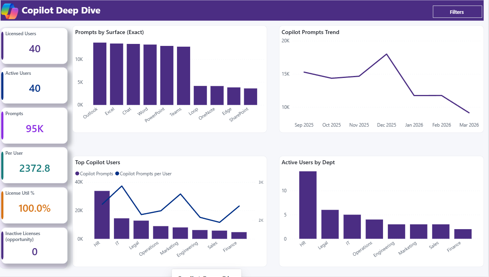
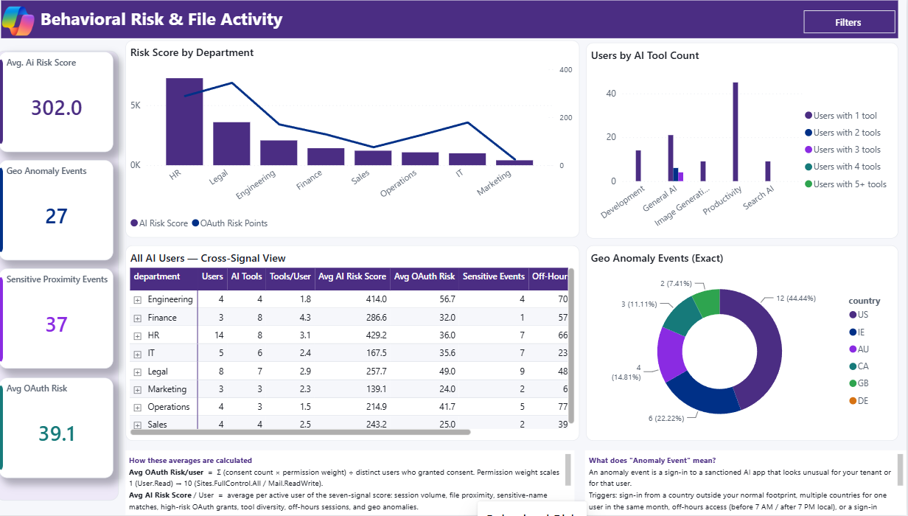
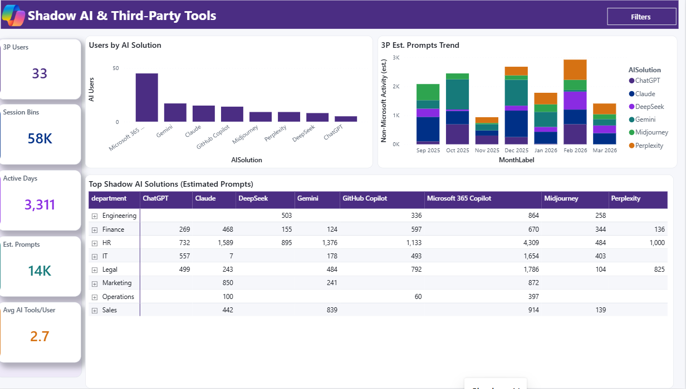
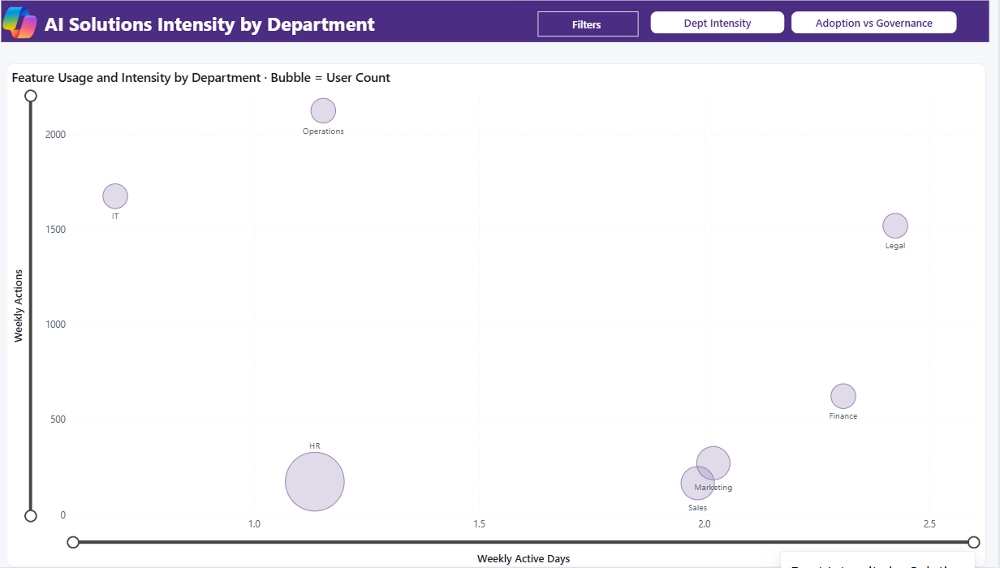
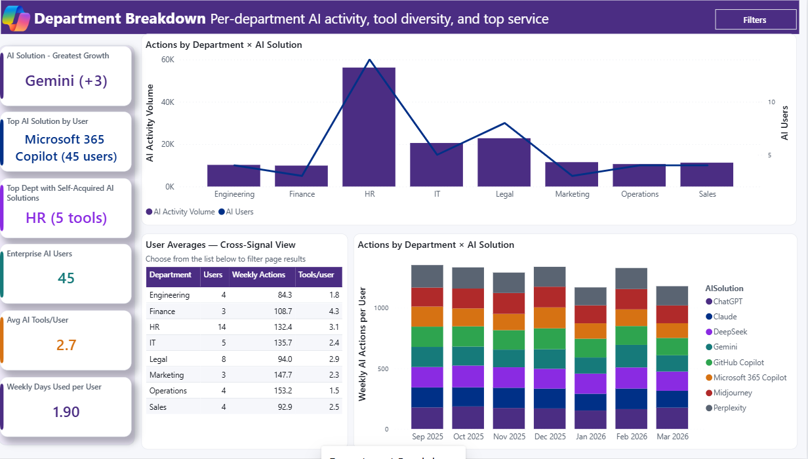
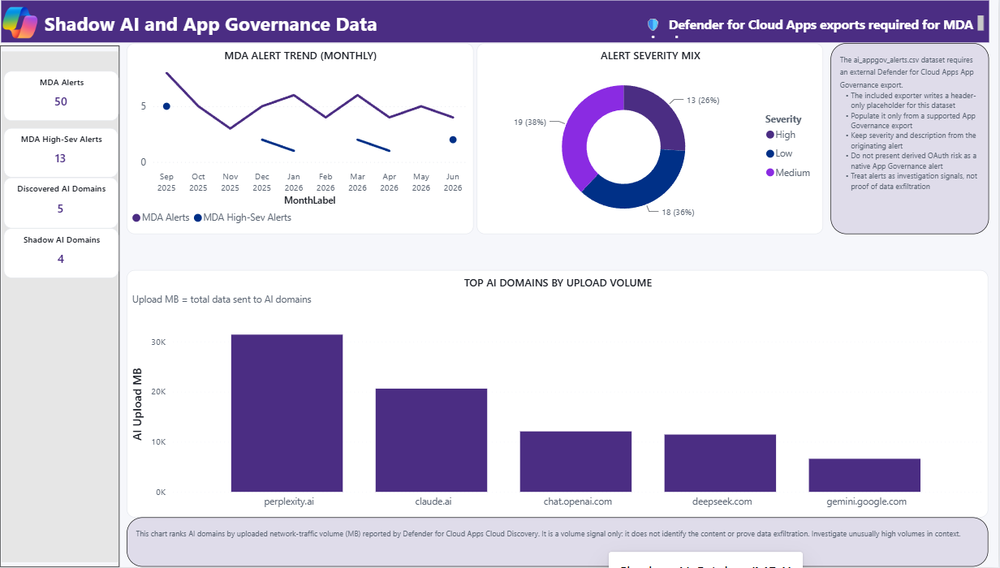
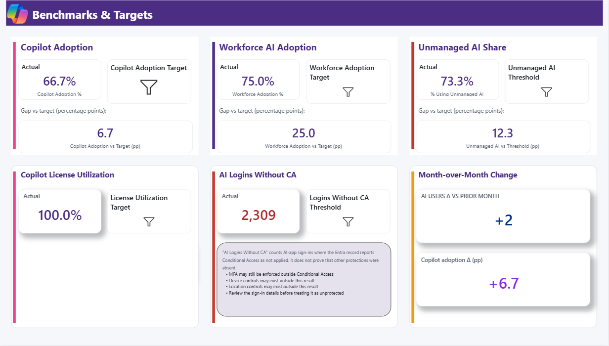
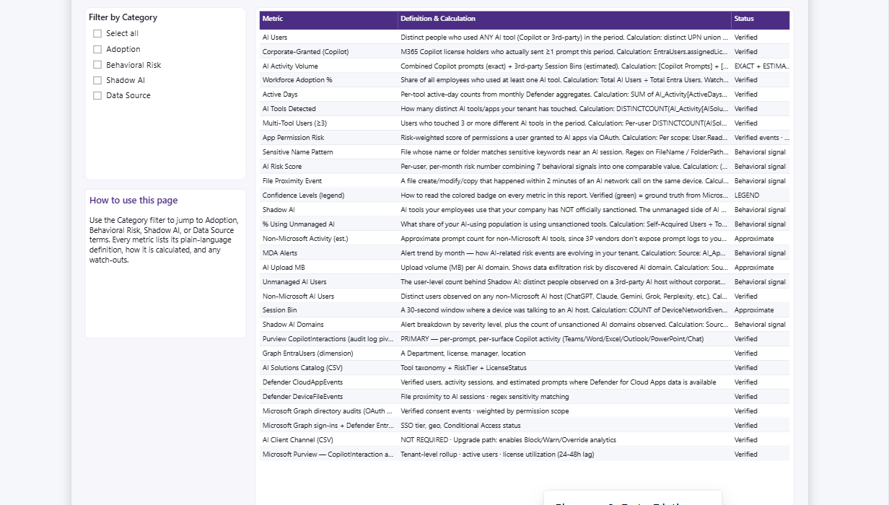
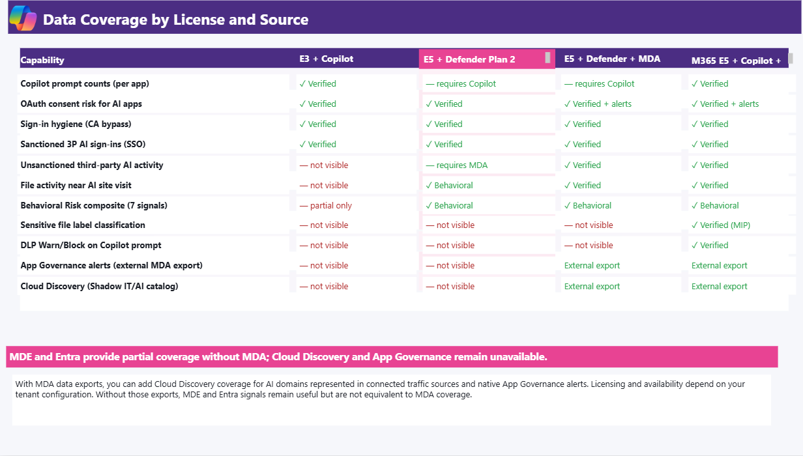

# AI Solutions Intelligence Dashboard

<div align="center">


**A single Power BI report that brings together source-dependent indicators for Copilot adoption, third-party AI activity, OAuth consent risk, off-hours/geo patterns, and optional Defender for Cloud Apps data.**

> **V27 In Testing - September 4, 2026:** Visual redesign with collapsible filters, updated evidence cards, corrected month-over-month KPIs, improved benchmark spacing, actual Power BI preview images, and a new interpretation guide and walkthrough. The data model continues to use the V26 13-file CSV contract.
>
> **Current template:** [V27 In Testing](AI-Solutions-Intelligence-Dashboard%20V27%20In%20Testing.pbit) is the repository's only published PBIT and has completed structural, privacy, CSV-contract, rendered-page, media, and exporter QA. "In Testing" communicates its experimental-use status, not incomplete release validation. The v26.2 query pack preserves the June 2026 live-validated query logic and adds September 2026 manual/PAX parity checks.

### 📥 [Click Here to Download All Files](https://github.com/microsoft/AI-Solutions-Intelligence-Dashboard/archive/refs/heads/main.zip)

**Related Templates & Tools:**

[](DATA_SETUP_START_HERE.md)
[](#before-you-start-prerequisites)
[](PAX_Exporter/README.md)
[](AI-Solutions-Intelligence-Dashboard%20V27%20In%20Testing.pbit)
[](INTERPRETATION_GUIDE.md)
[](AI-Solutions-Intelligence-Dashboard%20V27%20In%20Testing%20-%20Interpretation%20Storyboard.pptx)
[](media/AI-Solutions-Intelligence-Dashboard-Overview.mp4)
[](AI_Usage_v26_Blueprint.md)
[](INSTRUCTIONS_v26.md)
[](kql_queries_v22_E5V3.kql)
[](AI-Solutions-Intelligence-Dashboard-V26-Sample-Data.zip)
[](build_v26_sample_data.py)

**Additional Resources:**
[Defender for Endpoint docs](https://learn.microsoft.com/defender-endpoint/) · [Defender for Cloud Apps docs](https://learn.microsoft.com/defender-cloud-apps/) · [Microsoft Purview Audit docs](https://learn.microsoft.com/purview/audit-solutions-overview) · [Advanced Hunting API](https://learn.microsoft.com/graph/api/security-security-runhuntingquery)

⭐ **Star this repository** to receive notifications about new template versions
👀 **Watch** for updates and announcements

</div>

---

> [!WARNING]
> **Experimental use and compliance notice:** V27 is **In Testing**. This template is an investigation and planning aid, not a sole source of truth for licensing, security, privacy, legal, compliance, personnel, or procurement decisions. Coverage depends on licensing, onboarding, connectors, retention, configured app/domain lists, permissions, and source availability. Risk scores and anomalies are heuristic triage signals, and file proximity is correlation - not proof of upload, disclosure, misuse, or data leakage. Customers are responsible for lawful collection, access controls, sensitivity labels, retention, and compliance. The public template does not upload customer data to this repository; customers control collection, storage, deployment, and sharing. The sample package is fabricated. See the full [usage and compliance disclaimer](INTERPRETATION_GUIDE.md#usage-and-compliance-disclaimer).

## ▶️ Report preview

<div align="center"></div>

*Actual Power BI Desktop captures from the V27 In Testing template, loaded with the repository's deterministic synthetic sample data. No tenant or employee data is shown. The original illustrative V26 carousel is preserved in [`archive/design-reference/v26-illustrative-preview`](archive/design-reference/v26-illustrative-preview/README.md).*

> 🎬 **AI Solutions Intelligence Dashboard Overview (video):** a quick walkthrough of the dashboard's capabilities, interpretation guidance, and data-collection paths.
>
> https://github.com/user-attachments/assets/846ed8a9-b2bd-4368-8a5e-6810697fd788

---

## Before you start: prerequisites

You can explore with the synthetic sample data without tenant access. To populate
the dashboard with live data, confirm the following before choosing a collection
path.

| What you need | Requirement |
|---|---|
| Windows and Power BI | A supported Windows environment with the latest [Power BI Desktop](https://www.microsoft.com/en-us/download/details.aspx?id=58494) |
| Current report template | [AI-Solutions-Intelligence-Dashboard V27 In Testing.pbit](AI-Solutions-Intelligence-Dashboard%20V27%20In%20Testing.pbit), the only published PBIT |
| PowerShell | [PowerShell 7+](https://learn.microsoft.com/powershell/scripting/install/installing-powershell) and `ExchangeOnlineManagement` for Purview audit collection; `Microsoft.Graph` is needed only for the manual Graph examples |
| CSV folder | One local Windows folder for all 13 files, for example `C:\AI_Usage_Data\` |
| Microsoft Graph access | A full PAX export needs `User.Read.All`, `LicenseAssignment.Read.All`, `AuditLog.Read.All`, and `ThreatHunting.Read.All`: use delegated permissions with `-AccessToken`, or application permissions with an app registration. Tenant admin consent is required, and delegated collection also requires a supported Entra or Defender role |
| Audit and hunting access | Exchange Online **View-Only Audit Logs** or **Audit Logs** for `Search-UnifiedAuditLog`; Purview **Audit Reader** or **Audit Manager** for portal export; Defender XDR **Security Reader**, **Global Reader**, or assigned Unified RBAC hunting access |
| Source licenses and onboarding | The products and data sources you want to report on must be licensed, enabled, connected, and retaining data. Entra ID P2 supports sign-in events, MDE Plan 2 supplies device-event tables, and Defender for Cloud Apps is optional for MDA-backed pages |
| Power BI Service, if publishing | A Power BI workspace role and applicable Pro, PPU, or capacity license; local Power BI Desktop use does not require this |

The automated path also requires an access token or app registration. See the
[full permission matrix](INSTRUCTIONS_v26.md#step-0--prerequisites),
[PAX prerequisites](PAX_Exporter/README.md#before-you-start-prerequisites), and
[authentication guide](PAX_Exporter/docs/authentication.md) for exact setup
steps. Never store access tokens or client secrets in repository files.

---

## 🧭 Choose how to collect your data

Every tenant loads the **same report** from the **same 13 CSV files** — you just pick how to generate them.

<table>
<tr>
<td width="33%" valign="top">

### 🟢 One-time or smaller pull
**Manual CSV export**

Best when the expected event volume fits portal export limits. Copy-paste queries into the portal and use the supplied PowerShell collectors for Graph and Purview.

➡️ **[Start Here](DATA_SETUP_START_HERE.md)** · [Full manual guide](INSTRUCTIONS_v26.md)

</td>
<td width="33%" valign="top">

### 🔵 Repeat or high-volume pull
**Automated PAX exporter**

Use conservative adaptive time partitioning for repeatable Advanced Hunting exports. Review saturation warnings and source retention before treating an export as complete.

➡️ **[PAX Exporter](PAX_Exporter/README.md)**

</td>
<td width="33%" valign="top">

### 🧪 Just exploring
**Sample data**

Download the matching synthetic CSV package and tour the report with no tenant access.

➡️ **[Download Sample Data ZIP](AI-Solutions-Intelligence-Dashboard-V26-Sample-Data.zip)** · [Sample Data Generator](build_v26_sample_data.py)

</td>
</tr>
</table>

---

## 📚 Continue reading

<table>
<tr>
<td width="33%" valign="top">

**1 · [Start Here](DATA_SETUP_START_HERE.md)**

The friendly, non-technical overview. Begin here if you're new.

</td>
<td width="33%" valign="top">

**2 · [Setup & data collection](INSTRUCTIONS_v26.md)**

Every CSV, click-by-click — Graph, Purview, and Defender.

</td>
<td width="33%" valign="top">

**3 · [Automated exporter](PAX_Exporter/README.md)**

Run the PAX scripts to produce all 13 files with conservative partitioning.

</td>
</tr>
<tr>
<td width="33%" valign="top">

**4 · [KQL query pack](kql_queries_v22_E5V3.kql)**

The six validated Defender Advanced Hunting queries (v26.2).

</td>
<td width="33%" valign="top">

**5 · [Architecture blueprint](AI_Usage_v26_Blueprint.md)**

The tier model, measure design, and generator pipeline.

</td>
<td width="33%" valign="top">

**6 · [Security & license](SECURITY.md)**

Read-only permissions, data handling, and licensing notes.

</td>
</tr>
</table>

---

<details open>
<summary><strong>📊 Why Use This Report & Insights You Can Explore</strong></summary>

<br>

This dashboard brings several source-dependent indicators into one view: Copilot audit activity, catalog-classified third-party AI, OAuth consent risk, behavioral signals, and optional Microsoft Defender for Cloud Apps data. The same PBIT loads on every tier; visuals remain empty when their required source table is unavailable.

**Executive Overview:**
Track total AI users, adoption rate, license utilization, top tools, and monthly trends at a glance. Identify the gap between licensed capacity and actual usage with KPI cards that surface workforce adoption, per-surface Copilot prompt counts (Teams, Word, Excel, Outlook, PowerPoint, Chat), and department-level activity breakdowns.

**AI Adoption Strategy:**
Prioritize review of observed third-party AI, file-proximity correlations, off-hours/geo patterns, and OAuth consent events. These are heuristic triage indicators with possible false positives and false negatives. Coverage is source-specific: MDE Plan 2 supplies device-event signals, Entra supplies sign-ins, Purview supplies Copilot interactions, and Defender for Cloud Apps supplies `CloudAppEvents`, App Governance, and Cloud Discovery.

**Solution Priority:**
Prioritize AI tool governance with the solutions catalog (Sanctioned / Conditional / Unsanctioned tiers), benchmark adoption against configurable targets, and use the tier comparison matrix to understand which pages and signals map to your available data sources.

**AI Solutions Usage Activity & Trends:**
Drill into per-user activity across all signals, visualize department intensity with bubble charts (weekly days vs. weekly actions per user, capped at 7), and break down AI client channels (Browser / Desktop / API) by AI site. Optional MDA pages provide OAuth anomaly alerts, cloud discovery shadow AI catalogs with risk scores, and per-session DLP/policy enforcement intelligence.

</details>

---

<details>
<summary><strong style="font-size:1.5em;">🖥️ Report Pages Overview</strong></summary>

<br>

The dashboard includes **10** interactive report pages organized into core analytics, an MDA-powered catalog, and a consolidated glossary & data dictionary.

---

### 1. Executive Summary

KPI cards showing total AI users, adoption rate, top tools, and monthly trends. Includes workforce adoption donut, license utilization gauge, gap-to-target indicators, Copilot adoption percentage, and executive narrative verdicts. Works on E3 + Copilot baseline tier.

[](images/v27-report-pages/01-executive-summary.png)

*Actual V27 In Testing Power BI capture with synthetic sample data. Click to enlarge.*

---

### 2. Copilot Deep Dive

Dynamic, audit-event-derived Copilot activity breakdowns for every surface observed by Purview Audit, including Teams, Word, Excel, Outlook, PowerPoint, Chat, Loop, OneNote, SharePoint, Edge, and future workloads. These directional metrics can differ from the official Microsoft 365 Copilot usage report. Requires `ai_copilot_usage_graph.csv` and `ai_copilot_surface_usage.csv`.

[](images/v27-report-pages/02-copilot-deep-dive.png)

*Actual V27 In Testing Power BI capture with synthetic sample data. Click to enlarge.*

---

### 3. Behavioral Risk

Per-user triage scoring with file-proximity analysis (selected file create/modify/rename/copy events shortly after an observed AI-domain connection), off-hours percentages, geo anomaly counts, and a composite AI Risk Score. Temporal proximity does not prove upload, disclosure, or causation. OAuth consent patterns use Graph audit data. File proximity requires MDE Plan 2; off-hours analysis requires Microsoft Entra ID P2 and retained `EntraIdSignInEvents` data.

[](images/v27-report-pages/03-behavioral-risk.png)

*Actual V27 In Testing Power BI capture with synthetic sample data. Click to enlarge.*

---

### 4. Shadow AI

Observed third-party AI indicators showing catalog-classified tools, estimated non-Microsoft activity, percentage of users on tools classified as unmanaged, and tool-sprawl metrics. Classifications come from the local solutions catalog, and activity estimates are not vendor prompt logs. This page is populated by `CloudAppEvents` and therefore requires Defender for Cloud Apps; the MDE-only file-proximity and client-channel exports do not populate it.

[](images/v27-report-pages/04-shadow-ai.png)

*Actual V27 In Testing Power BI capture with synthetic sample data. Click to enlarge.*

---

### 5. Dept Intensity by Solution

Bubble chart plotting weekly days used vs. weekly actions per user (capped at 7), with tool and department slicers for drill-down. Visualizes adoption intensity across organizational units.

[](images/v27-report-pages/05-dept-intensity.png)

*Actual V27 In Testing Power BI capture with synthetic sample data. Click to enlarge.*

---

### 6. Department Breakdown

Department-level activity tables with per-AI-solution breakdowns, weekly trend filtering, and cross-department comparison metrics.

[](images/v27-report-pages/06-department-breakdown.png)

*Actual V27 In Testing Power BI capture with synthetic sample data. Click to enlarge.*

---

### 7. Shadow AI Catalog (MDA)

Cloud Discovery and App Governance view with source alert severity, catalog-classified domains, traffic volumes, and sanction status. Upload volume is a traffic signal; it does not identify content or prove exfiltration. **Requires Microsoft Defender for Cloud Apps** and the relevant connectors/exports.

[](images/v27-report-pages/07-shadow-ai-catalog.png)

*Actual V27 In Testing Power BI capture with synthetic sample data. Click to enlarge.*

---

### 8. Benchmarks & Targets

Interactive what-if parameters for locally selected adoption, utilization, unmanaged-AI, and logins-without-CA targets. Targets are organizational assumptions, not Microsoft benchmarks. "Without CA" means the Entra record reports Conditional Access as not applied; it does not prove that every other protection was absent.

[](images/v27-report-pages/08-benchmarks-targets.png)

*Actual V27 In Testing Power BI capture with synthetic sample data. Click to enlarge.*

---

### 9. Glossary & Data Dictionary

Consolidated reference page with plain-language definitions for every adoption, risk, and shadow AI metric, plus a data dictionary describing each source table and CSV. A static reference page that works on every license tier with no data dependency.

[](images/v27-report-pages/09-glossary-data-dictionary.png)

*Actual V27 In Testing Power BI capture with synthetic sample data. Click to enlarge.*

---

### 10. Tier Comparison

Planning matrix mapping report capabilities to product and data-source combinations. Product ownership alone does not guarantee data; onboarding, connector selection, permissions, regional availability, policy configuration, and retention also matter.

[](images/v27-report-pages/10-tier-comparison.png)

*Actual V27 In Testing Power BI capture with synthetic sample data. Click to enlarge.*

</details>

---

<details>
<summary><strong style="font-size:1.5em;">📨 Everything Your IT Admin Needs to Get Started</strong></summary>

<br>

Copy and send this pre-written email to your IT administrator or security team to request the access and permissions needed to populate the dashboard. It covers Microsoft Graph, Defender XDR, Purview, and (optionally) MDA portal access.

**Copy the request below into your preferred mail client.**

---

```
Subject: Access Request: AI Solutions Intelligence Dashboard Setup

Hi [IT Admin Name],

I'm setting up the AI Solutions Intelligence Dashboard to provide visibility
into AI usage across our Microsoft 365 tenant. I need the following access
to collect the required data:

1. Microsoft Graph API permissions:
   - User.Read.All, LicenseAssignment.Read.All, AuditLog.Read.All,
     ThreatHunting.Read.All

2. App registration and consent:
   - Add the four permissions above as Microsoft Graph Application permissions.
   - A Privileged Role Administrator or Global Administrator must grant tenant-wide
     admin consent for application permissions.

3. Microsoft Purview / Exchange Online audit:
   - View-Only Audit Logs (read/export) or Audit Logs for Search-UnifiedAuditLog.
   - Purview Audit Reader or Audit Manager for portal search/export.
   - eDiscovery roles alone do not satisfy this prerequisite.

4. Microsoft Defender XDR:
   - ThreatHunting.Read.All for the automated Graph query.
   - Security Reader, Global Reader, or an assigned Defender XDR Unified RBAC
     hunting role for interactive portal use.

5. Product and data prerequisites:
   - Microsoft Entra ID P2 for EntraIdSignInEvents.
   - Microsoft Defender for Endpoint Plan 2 for device-event tables.
   - Microsoft Defender for Cloud Apps plus the Microsoft 365 activities connector
     for CloudAppEvents; Security Reader or Global Reader for read-only portal use.

The collectors use read-only data APIs. Initial product activation, connector,
uploader, tenant-setting, or Conditional Access configuration can still require
separate administrative write operations.

Setup instructions:
https://github.com/microsoft/AI-Solutions-Intelligence-Dashboard

Please let me know if you need additional details.

Thank you!
```

</details>

---

<details>
<summary><strong style="font-size:1.5em;">📋 Instructions</strong></summary>

<br>

### Step 1. Collect Your Data (CSVs)

The dashboard expects 13 CSV filenames. Populate each source available in your tenant and use an exact header-only stub for any unavailable source. Save all files in a single folder (for example, `C:\AI_Usage_Data\`).

#### Path A — Setup without MDA (M365 E3/E5 + MDE Plan 2)

Collect the available baseline CSVs using Microsoft Graph, Purview Audit, and
Defender Advanced Hunting, then create header-only files for unavailable
sources. `CloudAppEvents` requires Defender for Cloud Apps, so no-MDA tenants
should run `Invoke-AISolutionsExport.ps1` with `-SkipActivitySessions`; the
script creates the exact `ai_activity_sessions.csv` stub and continues with the
other three hunting presets.

<details>
<summary><strong>Detailed step-by-step guide</strong></summary>

<br>

**Baseline CSVs to collect:**

| # | File | Source |
|---|---|---|
| 1 | `EntraUsers.csv` | Microsoft Graph (`Get-MgUser` with `-ExpandProperty manager`) |
| 2 | `ai_solutions_catalog.csv` | Manual — Excel → CSV with columns: `AISolution,Category,Vendor,RiskTier,DefaultDataHandling,SolutionGroup` |
| 3 | `ai_copilot_usage_graph.csv` | Microsoft Purview Audit (`CopilotInteraction` records, pivoted via PowerShell) |
| 4 | `ai_copilot_surface_usage.csv` | Microsoft Purview Audit (`CopilotInteraction` records, normalized to one row per user/month/surface) |
| 5 | `ai_activity_sessions.csv` | Defender XDR Advanced Hunting (`CloudAppEvents`) |
| 6 | `ai_oauth_consents.csv` | Entra Audit Logs via Graph (`Get-MgAuditLogDirectoryAudit`) |
| 7 | `ai_sso_signins.csv` | Entra Sign-In Logs via Graph (`Get-MgAuditLogSignIn`) |
| 8 | `ai_file_proximity.csv` | Defender XDR Advanced Hunting (`DeviceFileEvents` joined with `DeviceNetworkEvents`) |
| 9 | `ai_offhours_geo.csv` | Defender XDR Advanced Hunting (`EntraIdSignInEvents`) |
| 10 | `ai_client_channel.csv` | Defender XDR Advanced Hunting (Browser / Desktop / API split from UserAgent) |

**Then create 3 MDA stub files** (header-only CSVs):

`ai_appgov_alerts.csv`:
```csv
Timestamp,YearMonth,UPN,AppName,AlertType,Severity,Description
```

`ai_cloud_discovery.csv`:
```csv
AIDomain,AppCategory,YearMonth,RiskScore,UploadVolumeMB,DownloadVolumeMB,TransactionCount,DistinctUsers,SanctionStatus
```

`ai_mda_sessions.csv`:
```csv
Timestamp,YearMonth,UPN,AppName,ActionType,PolicyHit,PolicyAction,IPAddress,CountryCode,EventCount
```
For populated rows, `PolicyHit` must be `TRUE` or `FALSE`, and `PolicyAction` must be `Allow`, `Warn`, or `Block`.

MDA-backed visuals remain empty when these files contain only headers. MDE, Entra, and Purview-backed visuals continue to refresh.

See [INSTRUCTIONS_v26.md](INSTRUCTIONS_v26.md) for the complete PowerShell scripts, KQL queries, and step-by-step export procedures for each CSV.

</details>

---

#### Path B — Setup with Full MDA (M365 E5 + MDE Plan 2 + MDA)

Collect all 10 baseline CSVs from Path A, then populate the 3 MDA CSVs with real data from App Governance alerts, Cloud Discovery exports, and Conditional Access App Control session logs.

<details>
<summary><strong>Detailed step-by-step guide</strong></summary>

<br>

Complete all 10 baseline CSVs from Path A, then populate these 3 additional files:

| # | File | Source |
|---|---|---|
| 11 | `ai_appgov_alerts.csv` | Defender XDR Advanced Hunting (`AppGovernanceAlert` table, filtered for AI apps) |
| 12 | `ai_cloud_discovery.csv` | MDA portal → Cloud Discovery → Discovered Apps → Filter `Category = Generative AI` → Export CSV → reshape with PowerShell |
| 13 | `ai_mda_sessions.csv` | Defender XDR Advanced Hunting (`CloudAppEvents` with Conditional Access App Control session policies) |

**Prerequisites for Path B:**

- Microsoft Defender for Cloud Apps licensing and tenant configuration enabled by an authorized administrator
- App Governance enabled in a supported region; allow up to 10 hours for initial data
- Cloud Discovery log uploader configured (or MDE integration enabled for auto-discovery)
- Conditional Access App Control policies configured for your AI apps (e.g., ChatGPT Enterprise, Microsoft 365 Copilot)

See [INSTRUCTIONS_v26.md](INSTRUCTIONS_v26.md) for the complete KQL queries and export procedures.

</details>

---

### Step 2. Verify Prerequisites & Permissions

Ensure you have the required software, roles, and (optionally) Defender services enabled before collecting data.

<details>
<summary><strong>Detailed step-by-step guide</strong></summary>

<br>

#### Option A: Software Requirements

- [Power BI Desktop](https://www.microsoft.com/en-us/download/details.aspx?id=58494) (latest version)
- PowerShell 7+ with [ExchangeOnlineManagement](https://learn.microsoft.com/powershell/exchange/exchange-online-powershell-v2); the [Microsoft.Graph](https://learn.microsoft.com/powershell/microsoftgraph/installation) module is needed only for the manual Graph PowerShell examples
- One Windows folder for all CSVs, e.g. `C:\AI_Usage_Data\`
- Power BI Desktop is a Windows application. macOS users need a supported Windows environment or a separately published Power BI Service artifact.

#### Option B: Roles & Portal Permissions

| Portal | Minimum Role | Used For |
|---|---|---|
| Microsoft Graph application | `User.Read.All`, `LicenseAssignment.Read.All`, `AuditLog.Read.All`, `ThreatHunting.Read.All` | Automated users/licenses, OAuth, sign-ins, and Defender hunting |
| Admin-consent owner | Privileged Role Administrator or Global Administrator | Tenant-wide consent for Graph application permissions |
| Exchange Online audit | View-Only Audit Logs or Audit Logs | `Search-UnifiedAuditLog` Copilot collection |
| Microsoft Purview portal | Audit Reader or Audit Manager | Portal audit search and export |
| Microsoft Defender XDR portal | Security Reader, Global Reader, or assigned Unified RBAC hunting access | Interactive Advanced Hunting |
| Defender for Cloud Apps | Security Reader or Global Reader | App Governance and Cloud Discovery read access |
| Power BI workspace | Contributor, Member, or Admin | Publish a PBIX to an existing workspace |
| Power BI app | Member or Admin | Publish or update a workspace app |
| On-premises data gateway | Gateway administrator or authorized connection creator | Configure a refreshable local/UNC Folder source |

---

#### Option C: Enable Microsoft Defender for Endpoint (MDE Plan 2)

Required for the Behavioral Risk and Shadow AI pages.

1. **Verify licence** — Microsoft 365 admin centre → Billing → Your products. Confirm you have M365 E5, or E3 + MDE Plan 2 add-on.
2. **Onboard devices** — Defender XDR portal → Settings → Endpoints → Onboarding. Use Intune (simplest), Group Policy, or local script.
3. **Verify Advanced Hunting tables** — run `DeviceFileEvents | take 1` and `DeviceNetworkEvents | take 1` in Defender XDR → Hunting. If "table not found", wait 24 hours after onboarding.

📚 [Microsoft docs: Onboard devices to Defender for Endpoint](https://learn.microsoft.com/defender-endpoint/onboarding)

</details>

---

### Step 3. Open the Report in Power BI Desktop and Set Parameters

<details>
<summary><strong>Detailed step-by-step guide</strong></summary>

<br>

1. Download [AI-Solutions-Intelligence-Dashboard V27 In Testing.pbit](AI-Solutions-Intelligence-Dashboard%20V27%20In%20Testing.pbit), the repository's only published template.
2. Double-click the file → Power BI Desktop opens
3. When prompted for **`AI_Data_Folder_Path`**, paste your folder path:
   - Windows: `C:\AI_Usage_Data`
4. Click **Load** → wait 1–3 minutes for refresh
5. **File → Save As** → save as `.pbix` with a descriptive name (e.g. `AI_Solutions_<TenantName>_<YYYY-MM-DD>.pbix`)

</details>

---

## Next Steps

<details>
<summary><strong>Validation & Troubleshooting</strong></summary>

| Check | Path A (No MDA) | Path B (Full MDA) |
|---|---|---|
| Identity and Copilot KPI cards populated | ✅ | ✅ |
| Dept Intensity bubble chart, X-axis 0–7 | Empty without `CloudAppEvents` | ✅ |
| Behavioral Risk per-user averages displayed | Partial: MDE + Entra signals | ✅ |
| Shadow AI page, unmanaged AI metrics | Empty without `CloudAppEvents` | ✅ |
| Shadow AI Catalog (MDA) | Yellow callout + empty visuals | Yellow callout + populated visuals |
| Benchmarks & Targets sliders | ✅ | ✅ |

| Symptom | Cause | Fix |
|---|---|---|
| "We couldn't find the file" on load | Folder path is incorrect or the expected CSV is missing | Confirm the folder and CSV filename shown in the error |
| Shadow AI Catalog (MDA) visuals blank but no yellow callout | Stub CSV missing | Create the header-only CSVs from Path A instructions |
| All Copilot prompt counts = 0 | Used Defender CloudAppEvents instead of Purview | Re-export both Copilot CSVs with `Collect-AICopilotUsage.ps1` |
| Weekly Days Used per User > 7 | Old PBIT version | Re-download the latest PBIT; the measure is hard-capped at 7 |
| "Behavioral Risk" page empty | Missing MDE Plan 2 export | Re-export `ai_file_proximity.csv` and `ai_offhours_geo.csv` |
| Calendar slicer day-grain doesn't filter | Expected — fact tables are at month grain | Use Year / Quarter / Month slicer instead |
| `AppGovernanceAlert` table not found | App Governance not enabled | Enable App Governance in Defender XDR → Settings → Cloud Apps |
| Cloud Discovery page empty with MDA | Log uploader not configured | Configure Cloud Discovery via MDE integration or log uploader |

</details>

<details>
<summary><strong>Publish / Distribute</strong></summary>

1. Publish the `.pbix` to Power BI Service via **Home → Publish**
2. Configure the data source correctly:
   - Keep the local/UNC Folder source and configure an on-premises data gateway, or
   - Redesign the Power Query source to use the SharePoint/OneDrive connector and configure its credentials before publishing
   - Publishing alone does not make a local `C:\AI_Usage_Data` folder refreshable in the service
3. Share the workspace or create an app for stakeholders
4. Consider row-level security if department-scoped access is needed

</details>

<details>
<summary><strong>Interpretation & Action Planning</strong></summary>

- **Low adoption + high license count** → Focus enablement efforts; consider targeted training by department
- **High shadow AI usage** → Review the solutions catalog; consider sanctioning popular tools or tightening controls
- **Elevated behavioral risk scores** → Investigate file-proximity patterns and off-hours sessions; engage security team
- **OAuth permission weight spikes** → Review consent grants in Entra; consider admin consent workflow

</details>

<details>
<summary><strong>Monitor with Automatic Refresh</strong></summary>

1. Re-run the data collection queries on your preferred cadence (weekly is typical)
2. Overwrite the CSVs in your data folder with the new exports
3. In Power BI Desktop: **Home → Refresh** → Save
4. For Power BI Service refresh, either configure an on-premises gateway for the local/UNC Folder source or redesign the queries to use a SharePoint/OneDrive connector before publishing.

When upgrading from No-MDA to Full MDA later: overwrite the 3 stub CSVs with real exports, refresh the report — MDA pages light up automatically. **No PBIT change needed.**

</details>

</details>

---

## Data protection

Generated CSVs and PBIX files can contain user identifiers, IP addresses,
locations, user agents, and resource names. The public PBIT removes user-specific
security bindings and MSIP sensitivity-label metadata so it can be distributed
publicly; customer exports and derived reports are **not** automatically labeled,
encrypted, or access-controlled. Apply your organization's sensitivity label,
storage controls, retention policy, and least-access rules before sharing.

Power BI Desktop use is free. Publishing and sharing require the appropriate
Power BI Pro, Premium Per User, or qualifying capacity arrangement; PPU workspace
content requires PPU access for consumers.

---

<details>
<summary><strong style="font-size:1.5em;">🤓 Nerd Corner</strong></summary>

<br>

**Architecture:** The V27 PBIT builds on the unified V26 data model that replaced two parallel reports (`v22_E5_NoMDA_v2` and `v22_E5V3`). It gracefully handles the available customer tier. MDA-specific pages are clearly suffixed `(MDA)` and display a friendly yellow overlay when the underlying data is empty. No conditional DAX logic is needed — empty CSVs simply produce empty visuals.

**Tier model:** The report contains 10 pages total. Executive Summary, Copilot Deep Dive, Benchmarks & Targets, and the reference pages use Graph/Purview or static data. Behavioral Risk uses MDE and Entra signals. Activity, Shadow AI, department-intensity, and department-breakdown visuals depend on `CloudAppEvents` from Defender for Cloud Apps. Shadow AI Catalog (MDA) uses Cloud Discovery.

**Measures:** 123 total measures across 7 tables, including 5 interactive what-if parameter sliders, executive narrative verdicts, risk funnels, department-level scatter quadrant analysis, and the dynamic Copilot-surface measure.

**Empty-CSV fallback:** Rather than `try ... otherwise` in M (which can mask real refresh errors), customers create header-only stub CSVs. When MDA is later deployed, simply overwrite the stubs with real exports — same PBIT, no changes needed.

**Release integrity:**
```powershell
Get-FileHash '.\AI-Solutions-Intelligence-Dashboard V27 In Testing.pbit' -Algorithm SHA256
```

Expected SHA-256: `B0011494DDC4E2F4B42E19B25ED83AC8374A7D756186A713D4CDC31773C01B03`.
Superseded V26 PBIT artifacts and their root generator were removed so the
repository exposes one unambiguous template download. Their implementation
history remains available through Git.

**CSV count:** 13 total. `ai_copilot_surface_usage.csv` adds a normalized, future-compatible Copilot surface fact; the three MDA CSVs are `ai_appgov_alerts.csv`, `ai_cloud_discovery.csv`, and `ai_mda_sessions.csv`.

</details>

---

<details>
<summary><strong style="font-size:1.5em;">💬 Feedback</strong></summary>

<br>

Managed and released by the Microsoft Copilot Growth ROI Advisory Team. Please reach out to [copilot-roi-advisory-team-gh@microsoft.com](mailto:copilot-roi-advisory-team-gh@microsoft.com) with any feedback.

</details>

---

<details>
<summary><strong style="font-size:1.5em;">🔔 Stay Updated</strong></summary>

<br>

- ⭐ **Star this repository** to receive notifications about new template versions
- 👀 **Watch** for updates and announcements
- 🔄 Check back regularly for new features and improvements

</details>

---
